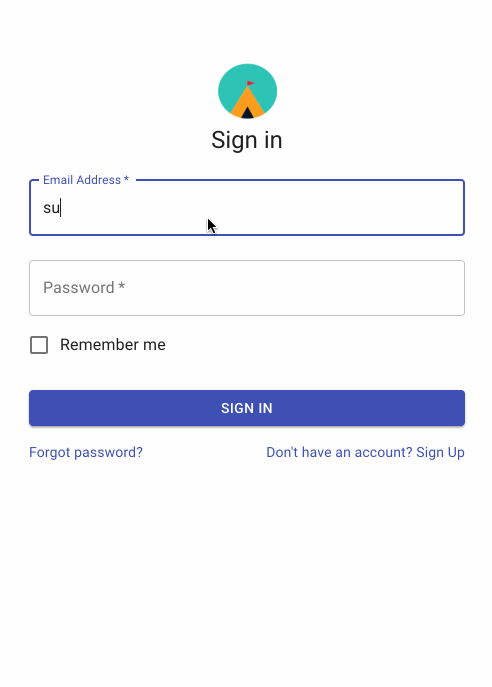

# EZCamp

# Contributors

- [Anindya Mehta](https://github.com/anindyamehta)
- [Jacky Wu](https://github.com/Jackywu1)
- [Josh Lee](https://github.com/joshyl)
- [Richard Yu](https://github.com/richardyu3)
- [Shannon Toft](https://github.com/nann3rs)
- [Will Trinh](https://github.com/willtrinh)
- [Yasi Khorram](https://github.com/Yasikhorram)

# Introduction

Many children’s summer camps these days have confusing registration, a ton of paperwork, and an unorganized and frequently changing calendar. For this project, we propose a camp registration and management application that will streamline the process for both parents and camp staff. Compared to competing products, we offer the benefits of a simple user interface, live chat, and real-time notifications.

# What does the app do?

- To offer a slick application that parents and camp staffers can use to easily register for and manage camps
- To create a simple user interface that allows parents and camp staffers to quickly communicate with each other
- To create a sign-up form, login form, a user dashboard (parents’ dashboard, staff dashboard), information board about the camp, and an events calendar.

# Tech stack

- [Express](https://expressjs.com/)
- [Node.js](https://nodejs.org/en/)
- [React](https://reactjs.org/)
- [Mongo](https://www.mongodb.com/)
- [Heroku](https://www.heroku.com/)

<!-- # Technical Challenges and research that you anticipated

- Why, what was the plan to overcome those challenges?
- What did you learn?

# Challenges that were unexpected

- Why was it a challenge
- What did you learn? -->

# Video Demo / Screen shot walkthrough of the app

- [Demo](https://youtu.be/kTbJygsHASc)

- As a camper:

- As a parent:

- As a counselor:

# User Stories
- As a Parent:
  - I want to register my child so that they can go to camp.
  - I want to let the counselors know what my child is allergic to
  - I want to know who is responsible for my child while they are at camp
  - I want to know what my child is doing today
  - I want to know what my child is doing for the week
  - I want to be able to contact the Counselor
  - I want the Counselor to be able to contact me if there are any issues
  - I want to know more information about the camp I’m sending my child to
- As a Camp Counselor:
  - I want to know which campers are allergic to a specific food
  - I want to know what activities are going on for today
  - I want to know what activities are going on for the week
  - I want to contact a parent in case of an emergency
  - I want to update the Camp Info to let users know we have new members
  - I would like to know which camper is approved to go to the zoo

# How does the app work?

- Parents: The application provides a sleek UI for parents to be able to easily navigate and find relevant information regarding current events related to the camp, such as the schedule. They will also be able to access information related to their children, such as registration paperwork and medical files.
- Camp Staff: The application allows the staff to be able to easily communicate with the parents. They will be able to send documents, provide live updates about scheduled events, and describe themselves for the parents to recognize during drop off.

<!-- # What research was required?

Workflow and Key lessons from your team - specifically those related to: Agile, CI/CD, testing, working with external stakeholders, ticketing, and user stories.

- Your git workflow, style guides, commit guides, etc
- What did you learn from the process
- What were key takeaways from stand ups, code reviews, etc
- Writing tests
- Link to your trello board, discuss completed tickets

# Any non-MVP tickets (optional)

Code refactorings
Performance Optimizations
Additional features
etc

# Notes from your Sprint Retro

# What additional features do you plan to add, how do you plan to implement those features?

- Future refactoring?
- Additional dev ops considerations?
- UI/UX additions?-->

# Available Scripts

In the project directory, you can run:

### `npm start`

in order to connect to the server.

`cd client`

In the client directory, you can run:

### `npm start`

in order to connect to the client.

Runs the app in the development mode.\
Open [http://localhost:3001](http://localhost:3001) to view it in the browser.

The page will reload if you make edits.\
You will also see any lint errors in the console.

### `npm test`

Launches the test runner in the interactive watch mode.\
See the section about [running tests](https://facebook.github.io/create-react-app/docs/running-tests) for more information.

### `npm run build`

Builds the app for production to the `build` folder.\
It correctly bundles React in production mode and optimizes the build for the best performance.

The build is minified and the filenames include the hashes.\
Your app is ready to be deployed!

See the section about [deployment](https://facebook.github.io/create-react-app/docs/deployment) for more information.
